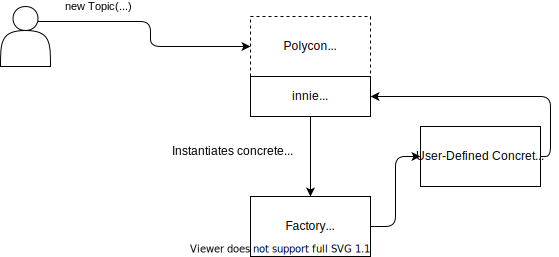

# Polycons!

Polycons ("polymorphic constructs").

Consider this the L4 Construct

## Current Repo Organization

This branch is currently muddling together multiple concepts that do not normally belong together:

polycons (/src root)
standard library (/src/std)
factory implementations (local nodejs currently) (/src/providers) 

This is done currently to be able to do some e2e experiments.  
This repo should end up only being very abstract, with some interfaces and base abstract classes

## Mark's Notes

Current attempts are trying to keep the "constructor pattern" that all CDKs do. This is difficult, as `new Whatever()` doesn't make sense when `Whatever` doesn't have a default concrete class of its own.

Not being able to use generics is pretty terrible.
Do we need to introduce the concept of construct subtrees? If so we could probably handle multiple factories in the same tree (of trees)
Should you be able to use "raw"/"concrete" constructs without going through the factory at all?


---


# Some Words

## Provisioner
The underlying "target", responsible for synthesis/deploy/etc
Typically represented by a factory, but a provisioner can have different factory implementations (aka cdk-aws vs cdk-azure)
CDK, terraform, etc.

## Factories
Responsible for instantiating concrete construct implementations

## ?? Concrete Resolver
Responsible for mapping a polycon to an actual construct

## Clients

Every polycon should have a client of some kind so that can interact with it via some sort of id
This is typically for use in Function runtimes
? Maybe not linked to any particular factory, even though it kinda is

## Asset Handling
Provisioners should handle assets.
Can/Should polycon-level abstraction avoid assets completely through APIs? Probably

## Token Resolvers

Given a polycon and an attribute somewhere within it, how to reference that value if tokenized?
This logic is already implemented by existing provisioners (CDK, terraform, etc.)
Factory is responsible for responsible for providing a token resolver.

## Permissions

Role-based abstraction? Handled by factories? Should we bother at all?
Idea, fluent API, stringy: (stolen from `iam-floyd`) 
```typescript
Permissions.of(polyconstruct)
// principal, could have polycon-level abstractions here (User)
.for('user')
.allow('read')
.deny('write')
```


## Polycons of POCIX

### REST API
HTTP endpoint for invoking functions
Client API
- Request/Response parsing/types
- Invoke remote API
Infra API
- REST methods to trigger Function (.get(), .post(), etc.)

### GraphQL API
Pretty much AppSync-ish

### Function
Serverless code execution

### Bucket
Storage of files/folders
Client API
- Store/Retrieve files/folders
Infra API
- Store/Retrieve files/folders (as Asset, during deployment)

### Queue
A queue, not sure what else to say

### Topic
pubsub

### Schedule
CRON system

### Output
Easy output system for display/data/automation purposes

### Secret
? How to provision secrets securely
? Consume secrets in other resources in a provider-specific way (per-factory value Resolvers?)

### Document
Key/value object storage
Name is kinda stolen from Nitric

## Diagrams



